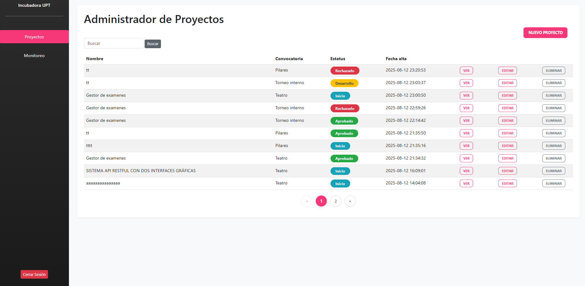
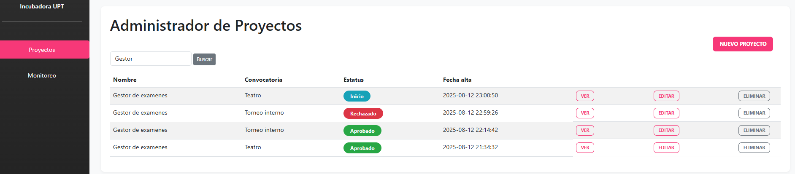
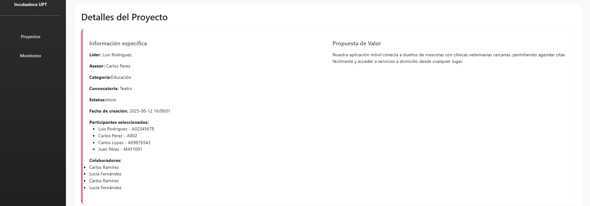
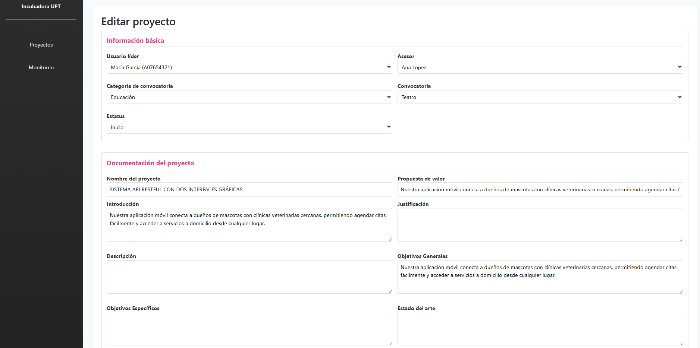
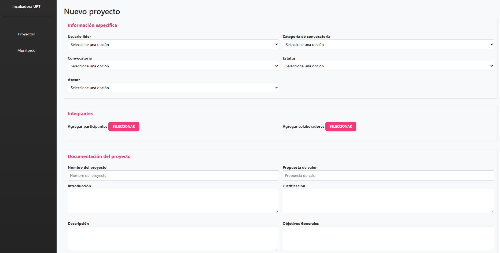
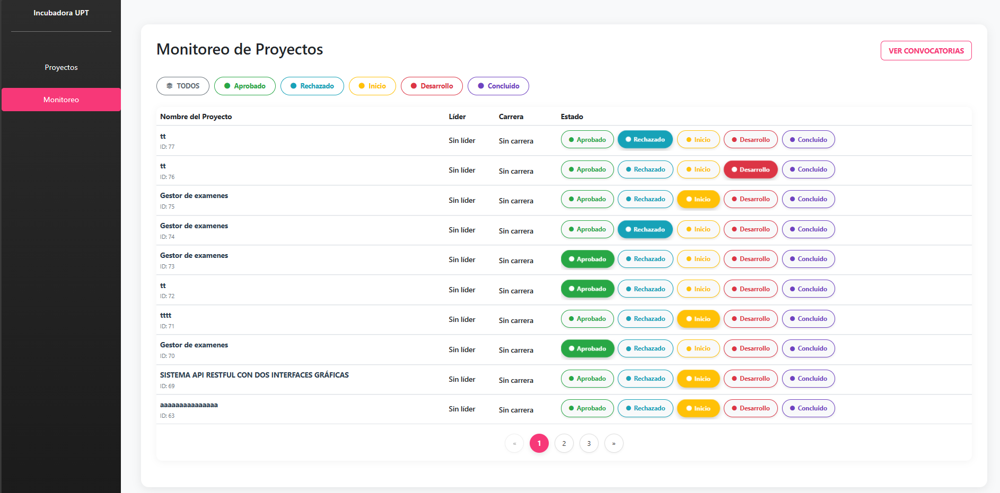
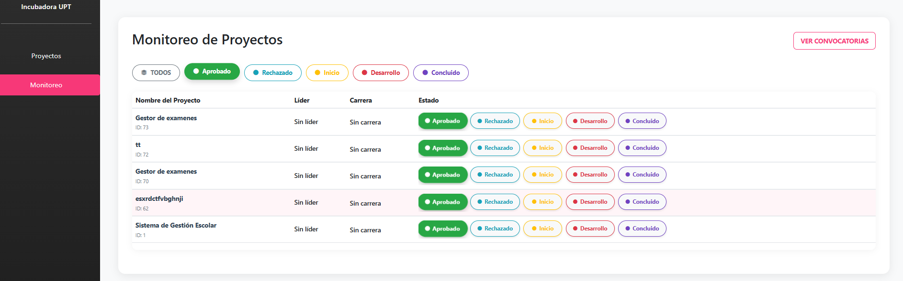
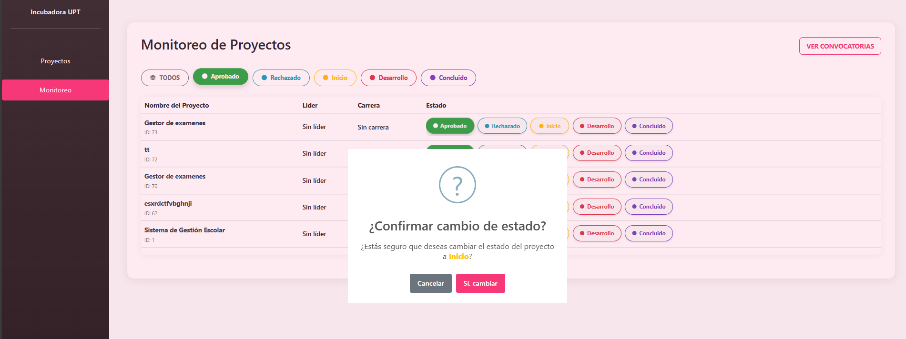
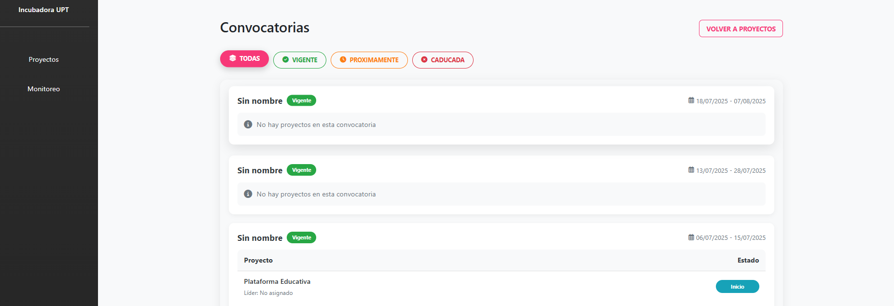
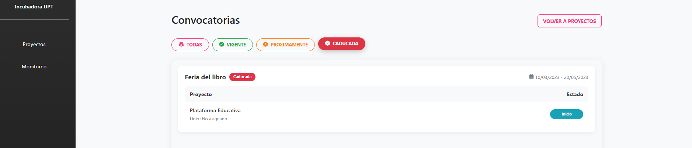

<h1>Entrepreneurial Projects Linkage System (SVPE)</h1>

<section>
  <h2>🎯 General Description</h2>
  

    The <strong>Entrepreneurial Projects Linkage System (SVPE)</strong> was developed for the 
    <strong>Polytechnic University of Tulancingo (UPT)</strong> in collaboration with the 
    <strong>Hidalgo Computing Network (REHICO)</strong>. Its purpose is to link entrepreneurial projects 
    from the university’s student and research community with calls for proposals that have social, 
    ecological, or technological impact, while providing tools for monitoring and managing the required documentation.
  

</section>

<section>
  <h2>🧭 Role and Methodology</h2>
  

    I led the project as <strong>Project Manager</strong> and development team coordinator, applying 
    the <strong>PMBOK</strong> project management methodology to ensure proper planning, execution, and 
    project tracking. My responsibilities included technical direction, task coordination, and deliverable validation.
  

</section>

<section>
  <h2>🤝 Inter-University Collaboration</h2>
  

    SVPE was a collaborative project developed among several institutions.  
    The <strong>Technological University of the Mezquital Valley (UTVM)</strong> was responsible for 
    developing the <strong>Projects</strong> and <strong>Monitoring</strong> modules, while other participating 
    universities worked on complementary modules such as <em>Users, Calls, Linkage,</em> and <em>Reports</em>.
  

</section>

<section>
  <h2>⚙️ Technologies Used</h2>
  

    The system was initially developed in <strong>.NET</strong> and <strong>Microsoft SQL Server</strong>, 
    and later migrated to <strong>Laravel</strong> with <strong>MySQL</strong> to achieve a more flexible 
    and scalable architecture.
  

  

    Laravel
    MySQL
    PHP
    HTML5
    CSS3
    PMBOK
  

</section>

<section>
  <h2>🧩 Modules Developed (UTVM)</h2>

  <h3>📁 Projects</h3>
  

    Allows management of projects registered in the university incubator.  
    Its main features include:
  

  <ul>
    <li>Creation, editing, and deletion of projects.</li>
    <li>Viewing detailed project information in a dynamic table.</li>
    <li>Exporting project documentation to PDF format.</li>
  </ul>
  

    
    
    
    
    
  

  <h3>📊 Monitoring</h3>
  

    Provides tools to analyze, query, and update the status of linked projects.  
    Its main features include:
  

  <ul>
    <li>Viewing project details and associated calls for proposals.</li>
    <li>Status updates and advanced filtering options.</li>
    <li>Visual monitoring of project progress.</li>
  </ul>
  

    
    
    
    
    
  

</section>

<section>
  <h2>🚀 System Objective</h2>
  

    SVPE aims to strengthen the connection between the academic community and impactful calls for proposals, 
    promoting innovation and entrepreneurship through a reliable, collaborative, and centralized digital platform.
  

</section>

<footer>
  
Developed for the <strong>Hidalgo Computing Network (REHICO)</strong> — Polytechnic University of Tulancingo.

  
UTVM module coordination | Project leadership: <strong>Ángel García Aguazul</strong>

</footer>

## About Laravel

Laravel is a web application framework with expressive, elegant syntax. We believe development must be an enjoyable and creative experience to be truly fulfilling. Laravel takes the pain out of development by easing common tasks used in many web projects, such as:

-   [Simple, fast routing engine](https://laravel.com/docs/routing).
-   [Powerful dependency injection container](https://laravel.com/docs/container).
-   Multiple back-ends for [session](https://laravel.com/docs/session) and [cache](https://laravel.com/docs/cache) storage.
-   Expressive, intuitive [database ORM](https://laravel.com/docs/eloquent).
-   Database agnostic [schema migrations](https://laravel.com/docs/migrations).
-   [Robust background job processing](https://laravel.com/docs/queues).
-   [Real-time event broadcasting](https://laravel.com/docs/broadcasting).

Laravel is accessible, powerful, and provides tools required for large, robust applications.

## Learning Laravel

Laravel has the most extensive and thorough [documentation](https://laravel.com/docs) and video tutorial library of all modern web application frameworks, making it a breeze to get started with the framework.

You may also try the [Laravel Bootcamp](https://bootcamp.laravel.com), where you will be guided through building a modern Laravel application from scratch.

If you don't feel like reading, [Laracasts](https://laracasts.com) can help. Laracasts contains thousands of video tutorials on a range of topics including Laravel, modern PHP, unit testing, and JavaScript. Boost your skills by digging into our comprehensive video library.

## Laravel Sponsors

We would like to extend our thanks to the following sponsors for funding Laravel development. If you are interested in becoming a sponsor, please visit the [Laravel Partners program](https://partners.laravel.com).

### Premium Partners

-   **[Vehikl](https://vehikl.com)**
-   **[Tighten Co.](https://tighten.co)**
-   **[Kirschbaum Development Group](https://kirschbaumdevelopment.com)**
-   **[64 Robots](https://64robots.com)**
-   **[Curotec](https://www.curotec.com/services/technologies/laravel)**
-   **[DevSquad](https://devsquad.com/hire-laravel-developers)**
-   **[Redberry](https://redberry.international/laravel-development)**
-   **[Active Logic](https://activelogic.com)**

## Contributing

Thank you for considering contributing to the Laravel framework! The contribution guide can be found in the [Laravel documentation](https://laravel.com/docs/contributions).

## Code of Conduct

In order to ensure that the Laravel community is welcoming to all, please review and abide by the [Code of Conduct](https://laravel.com/docs/contributions#code-of-conduct).

## Security Vulnerabilities

If you discover a security vulnerability within Laravel, please send an e-mail to Taylor Otwell via [taylor@laravel.com](mailto:taylor@laravel.com). All security vulnerabilities will be promptly addressed.

## License

The Laravel framework is open-sourced software licensed under the [MIT license](https://opensource.org/licenses/MIT).
